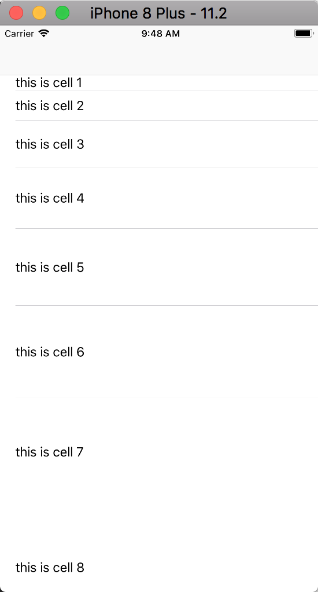

# 目的
本库的目的是让tableview的使用变得更简单和高效（还不支持collectionview）,并将datasource和delegate从vc中分离出来。同时将数据处理和UI设计分离,让用户专注数据处理和UI设计。
# 如何使用  
直接拷贝源码到你的工程，或者编`KIVListKit`工程后直接使用生成的`framework`。

# 用法
## 创建section

>let sec1 = KivTableViewSection()

## 创建row
>let row = KivTableViewRow()

# Cell
cell需要遵循KivListBaseCellProtocol接口，并实现相关方法。

## 将处理好的数据装配给row

>  `row.cellClassType = Custom1TableViewCell.self `		//row对应cell的类型   
`row.codeType = .code`  				//row的类型
`row.height = 20.0*Double(i)`  		//row的高度计算，可以提前计算好
`row.data = "this is cell \(i)"`  	//处理好的数据赋值给row
`sec1.add(row)`  						//添加到sec中

## 给Tableview装配数据
>self.tableView.addSections(newSections: sections)

## Datasuorce和Delegate
在初始化完成tableview后需要指定其datasource和delegate,此时可以使用默认datasuorce和delegate
>self.tableView.registerDefault()

自定义Datasuorce和Delegate只需继承KIVTableListDataSouce 类即可，添加自己需要的UITableViewDataSource,UITableViewDelegate方法。

源码请查看Demo,效果如下图

以上section和row使用的组合方式，也可以通过基础自己的section和row进行添加需要的属性，比如一些处理block。继承后可以自定义高度计算方法，通过row的get属性返回。如果是多层表，可以通过section和row来行程一个数据树，通过这个数据树就可以定位到每一层的数据。

